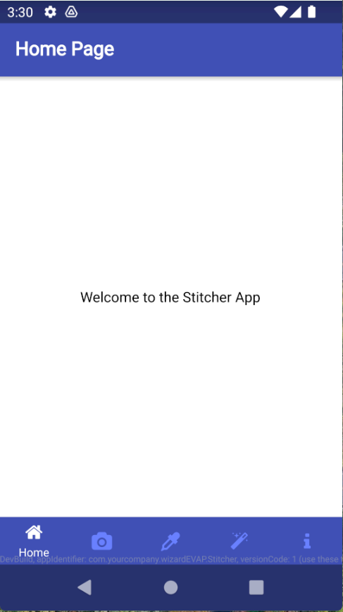

# Image Stitching Application on Mobile Devices

This project aims to create a mobile application that combines images taken from different angles to generate panoramic images. The project is developed using Qt and OpenCV libraries and can be run on the Android platform.

## Table of Contents
1. [Introduction](#introduction)
2. [Features](#features)
3. [Technologies Used](#technologies-used)
4. [Installation](#installation)
5. [Usage](#usage)
6. [Contributing](#contributing)
7. [License](#license)

## Introduction

This project is developed as a term project for the Android Programming course in the Computer Engineering Department at Karadeniz Technical University. The project aims to perform multi-image stitching operations on mobile devices.

## Features

- Image processing using Qt and OpenCV
- Stitching images taken from different angles
- User-friendly interface
- Compatible with Android platform

## Technologies Used

- [Qt](https://www.qt.io/): A powerful framework for GUI development
- [QML](https://doc.qt.io/qt-5/qtqml-index.html): A flexible and easy-to-use UI development environment
- [OpenCV](https://opencv.org/): An open-source computer vision and machine learning software library

## Installation

### Requirements

- Qt 5.15 or above
- OpenCV 4.x or above

### Steps

1. Install Qt and OpenCV.
2. Clone this repository:
    ```sh
    git clone https://github.com/osmancanaksoy/image-stitching-mobile-app.git
    cd image-stitching-mobile-app
    ```
3. Open the project with Qt Creator and build it for Android.

## Usage

1. Launch the application.
2. Select the images you want to stitch.
3. Press the "Stitch" button to combine the images.
4. Review and save the results.

   <p float="left">
      
      
      
      
      
      
   </p>

## Contributing
We welcome contributions to improve this project. Here are some ways you can contribute:

- **Report Bugs**: If you find a bug, please open an issue with detailed information.
- **Submit Pull Requests**: If you have a fix or a new feature, submit a pull request. Please ensure your code follows the project's coding standards.

## License

This project is licensed under the MIT License - see the [LICENSE](LICENSE) file for details.
